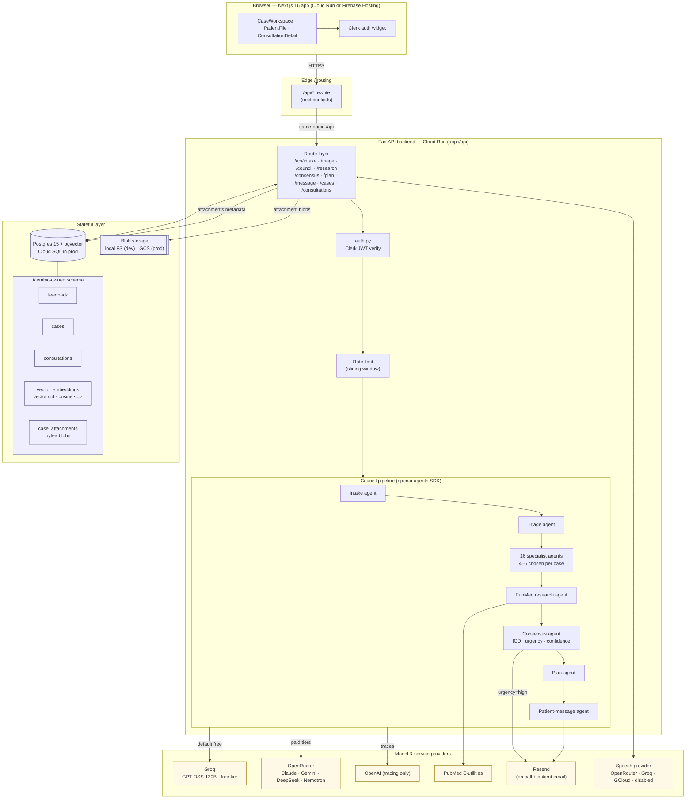

# MedAI Council

A multi-specialty clinical deliberation system. Sixteen AI specialists
deliberate on a patient case in parallel, consult the literature, converge
on a diagnosis, and return a plan plus a message the patient can act on.

**Status:** research artefact · demonstration only · not a substitute for
licensed medical advice.

---

## Repository layout

```
medai-council/
├── apps/
│   ├── api/                      FastAPI backend — the actual council pipeline
│   │   ├── main.py               ASGI entrypoint, routes, startup (Alembic runs here)
│   │   ├── council.py            Specialist Agent definitions (openai-agents SDK)
│   │   ├── council_*.py          Registry, schemas, tools, handoffs
│   │   ├── db.py                 Postgres connection seam (DATABASE_URL)
│   │   ├── storage.py            Blob storage seam (local FS / GCS)
│   │   ├── vector_store.py       pgvector store (Vertex stub alongside)
│   │   ├── attachments.py        Postgres-backed case attachments
│   │   ├── speech.py             Speech provider swap (OpenRouter/Groq/GCloud)
│   │   ├── alembic/              Owned schema + migrations
│   │   ├── Dockerfile            Multi-stage, non-root, runs migrations
│   │   ├── pyproject.toml + uv.lock   Python deps (uv)
│   │   └── requirements.txt      Exported from uv.lock for Docker builds
│   └── web/                      Next.js 16 frontend (App Router + Clerk + Tailwind v4)
│       ├── app/                  Routes — /, /case, /patient/consultations/[id]
│       ├── components/case/      CaseWorkspace, PatientFile, ConsultationDetail
│       └── Dockerfile            Standalone output → Cloud Run
├── terraform/                    Cloud Run + Cloud SQL + GCS + Secret Manager
├── docker-compose.yml            Local pg + api + web
├── .github/workflows/            ci.yml · deploy.yml · destroy.yml
├── DECISIONS.md                  Why each major choice was made
├── pnpm-workspace.yaml
├── package.json                  Monorepo root — pnpm workspace scripts
└── README.md
```

Two services, one deploy target: **GCP**. The FastAPI backend runs on Cloud Run with Cloud SQL (Postgres) and Cloud Storage (GCS) for blobs; the Next.js app ships alongside it (Cloud Run service or Firebase Hosting, depending on build needs). Local dev uses your own Postgres and the filesystem — configured entirely by env vars (`DATABASE_URL`, `STORAGE_BACKEND`).

See [`DECISIONS.md`](./DECISIONS.md) for the rationale behind every major
architectural choice on this page (why Postgres + pgvector over SQLite +
numpy, why OpenRouter + Groq side-by-side, why Cloud Run over Vercel, etc.).

---

## Architecture



**Request path in one line.** Browser → Next.js same-origin `/api/*` rewrite →
FastAPI (Clerk JWT → rate limit → route handler → seven-stage pipeline of
openai-agents) → Postgres for state + Groq/OpenRouter for inference + GCS
(or local FS) for blobs.

**Key seams.**

- `apps/api/db.py` — one `connect()` function, driver chosen by `DATABASE_URL`. Every handler goes through it; swapping Postgres for anything else is a single file.
- `apps/api/storage.py` — `get_storage()` abstracts blob I/O so the GCS cutover is `STORAGE_BACKEND=gcs` + a bucket name.
- `apps/api/vector_store.py` — `PostgresVectorStore` today; a `VertexVectorStore` stub is in place for the eventual Vertex AI Vector Search migration.
- `apps/api/speech.py` — one `OpenAICompatibleSpeechProvider` that points at OpenRouter, Groq, or OpenAI by env var, plus a `gcloud` branch for Google Speech when running on GCP.
- `apps/api/council_registry.py` — curated model allowlist; `groq:` slug prefix routes through the Groq client, everything else goes through OpenRouter.

---

## Prerequisites

- **Node ≥ 20** and **pnpm ≥ 9** (for the web app)
- **[uv](https://docs.astral.sh/uv/getting-started/installation/)** (for the API — installs Python 3.12 + deps from `apps/api/pyproject.toml`)
- **Python 3.12** (optional if you let `uv` manage interpreters; see `apps/api/.python-version`)
- **Postgres 15+** running locally (Postgres.app, `brew services start postgresql@15`, or Docker). Create a database named `medai_council`.
- Accounts:
  - [OpenRouter](https://openrouter.ai) — model inference
  - [OpenAI](https://platform.openai.com) — tracing only (free)
  - [Clerk](https://dashboard.clerk.com) — authentication
  - [Resend](https://resend.com) — patient / on-call email (optional in dev)
  - **GCP** — Cloud Run + Cloud SQL + GCS for deployment

---

## First-time setup

### 1. Install web dependencies

```bash
pnpm install
```

### 2. Install API dependencies

From the **repository root** (uses [uv](https://docs.astral.sh/uv/) and `apps/api/pyproject.toml` + `uv.lock`):

```bash
pnpm run api:install
```

Or manually:

```bash
cd apps/api
uv sync
```

`requirements.txt` in `apps/api/` is **exported from the lockfile** (`uv export …`) for Docker builds and any host that only reads `requirements.txt`. After changing dependencies in `pyproject.toml`, run `uv lock` and re-export:

```bash
cd apps/api && uv lock && uv export --no-hashes --no-dev -o requirements.txt
```

### 3. Configure environment

Copy both example files and fill in values:

```bash
cp apps/api/.env.example apps/api/.env
cp apps/web/.env.example apps/web/.env.local
```

Minimum required to run the API:

- `OPENROUTER_API_KEY` · [openrouter.ai/keys](https://openrouter.ai/keys)
- `OPENAI_API_KEY` · [platform.openai.com/api-keys](https://platform.openai.com/api-keys) (tracing only)
- `DATABASE_URL` · e.g. `postgresql://$USER@localhost:5432/medai_council` (local Postgres). When deployed, set this to the Cloud SQL connection string.
- `STORAGE_BACKEND` · `local` (default; writes under `apps/api/storage_data/`) or `gcs` — with `GCS_BUCKET=<your-bucket>` when set to `gcs`.

The web app can boot in **Clerk Keyless mode** without any Clerk keys
— Clerk auto-provisions temporary dev keys the first time it loads,
and shows a "Claim your application" prompt you can click to attach
your own Clerk account later.

---

## Development

Run the two services in separate terminals.

### Frontend (Next.js on :3000)

```bash
pnpm dev
```

### Backend (FastAPI on :8000)

**From repo root (recommended):**

```bash
pnpm run api:install   # once: uv sync → .venv under apps/api
pnpm run api:dev       # uv run uvicorn … on http://127.0.0.1:8000
```

**From `apps/api` directly:**

```bash
cd apps/api
uv sync
uv run uvicorn main:app --reload --port 8000
```

The process cwd is **`apps/api`**, so `main.py`, `auth.py`, and the council modules import correctly. `uv` keeps the virtualenv at **`apps/api/.venv`** by default.

The frontend calls the backend via `NEXT_PUBLIC_API_BASE_URL` (default
`http://localhost:8000`). Clerk-protected routes live under `/case`.

---

## The pipeline (seven stages)

| №   | Stage     | Endpoint                      | What it does                                   |
| --- | --------- | ----------------------------- | ---------------------------------------------- |
| I   | Intake    | `POST /api/intake/followup`   | Generates four clarifying questions            |
| II  | Triage    | `POST /api/triage`            | Selects 4–6 specialists for deliberation       |
| III | Council   | `POST /api/council/physician` | Per-specialist assessment, one call each       |
| IV  | Research  | `POST /api/research`          | PubMed evidence round-up                       |
| V   | Consensus | `POST /api/consensus`         | Structured diagnosis, ICD, confidence, urgency |
| VI  | Plan      | `POST /api/plan`              | Cross-specialty treatment plan                 |
| VII | Message   | `POST /api/message`           | Empathetic patient-facing summary              |

A follow-up Q&A loop is available at `POST /api/message/followup`.

---

## Deploy (GCP)

Terraform under `terraform/` provisions the full stack:

- **Artifact Registry** — Docker repo for the API image.
- **Cloud SQL (Postgres 15)** — `medai_council` database; pgvector is
  enabled by the API at startup.
- **GCS bucket** — attachment blobs (when `STORAGE_BACKEND=gcs`).
- **Cloud Run v2** — runs `apps/api/Dockerfile`, mounts the Cloud SQL socket
  at `/cloudsql`, binds secrets from Secret Manager as env vars.
- **Secret Manager** — container resources for `OPENROUTER_API_KEY`,
  `OPENAI_API_KEY`, `CLERK_*`, `RESEND_*`, `DATABASE_URL`, etc. Values
  provisioned after `terraform apply` (see `terraform/README.md`).

Build + push + apply:

```bash
REGION=us-central1
PROJECT=$(gcloud config get-value project)
TAG=$(git rev-parse --short HEAD)

gcloud auth configure-docker ${REGION}-docker.pkg.dev -q
docker buildx build --platform linux/amd64 \
  -f apps/api/Dockerfile \
  -t ${REGION}-docker.pkg.dev/${PROJECT}/medai/api:${TAG} \
  --push apps/api

cd terraform
terraform init -backend-config="bucket=${PROJECT}-tfstate"
terraform apply -var="project_id=${PROJECT}" -var="image_tag=${TAG}"
```

See `terraform/README.md` for first-time setup and secret population.

---

## Roadmap

- [x] **Step 1** — commit current state to `main`
- [x] **Step 2a** — monorepo restructure + Next.js scaffold + Clerk auth gate
- [x] **Step 2b–d** — seven pipeline stages in `/case` (`CaseWorkspace` → FastAPI)
- [x] **Step 3** — case autosave via SQLite `cases` table + `/api/cases` _(migrating to Postgres)_
- [x] **Step 4** — on-call email via Resend when consensus urgency is high _(needs `RESEND\__` env)\*
- [x] **Step 5** — optional `RATE_LIMIT_ENABLED` sliding window on `POST /api/*` _(SSE / parallel fan-out still open)_
- [x] **Step 6** — paywall banner placeholder (`NEXT_PUBLIC_FEATURE_PAYWALL=1`) _(Stripe later)_
- [ ] **Step 7** — GCP migration (Cloud Run + Cloud SQL + GCS)
  - [x] Remove Vercel artefacts; target GCP Cloud Run
  - [x] Add `psycopg` + `alembic` + `google-cloud-storage`; introduce `db.py` and `storage.py` seams
  - [x] Port SQL sites in `main.py` / `council_tools.py` to Postgres (`%s`, `TIMESTAMPTZ`, `JSONB`)
  - [x] `vector_store.py` → `pgvector` (`vector` column + `<=>` cosine operator)
  - [x] `attachments.py` → Postgres `bytea` (GCS swap stays stubbed for deploy step)
  - [x] Alembic scaffold + initial migration (`alembic/versions/0001_initial.py`); `alembic upgrade head` runs on container startup via `docker-entrypoint.sh`
  - [x] Speech provider swap (`SPEECH_PROVIDER=openai|gcloud|disabled`) with Groq-compatible base-URL override and structured 429 on quota exhaustion
  - [ ] `GcsAttachmentStore` — move blobs to `storage.get_storage()`, keep metadata in Postgres
  - [x] Dockerfile (multi-stage, non-root, tini, runs migrations before uvicorn) at `apps/api/Dockerfile`
  - [x] Terraform (Cloud Run + Cloud SQL + pgvector + GCS + Secret Manager + Artifact Registry + Speech APIs) under `terraform/`

---

## Model inference

Two providers are wired side-by-side and routed via slug prefix in
`apps/api/council_registry.py`:

- **Free tier (default):** `groq:openai/gpt-oss-120b` — OpenAI's open-weight
  120B served on Groq. Fast, reliable, and generous on the free plan.
- **Pro tier:** anything else in the registry (Claude Opus 4.7, Gemini 2.5
  Pro, DeepSeek R1, Nemotron 120B) routed through **OpenRouter**.
- **Tracing** goes to OpenAI via `OPENAI_API_KEY` — that key is deliberately
  not reused for inference or speech (see `DECISIONS.md`).

Users can select a model per case via the `ModelSelector` component; locked
(pro-only) models return a structured 402 if called without the entitlement.

---

## Tracing

All agent runs export to [platform.openai.com/traces](https://platform.openai.com/traces)
via the Agents SDK's built-in tracer. Uses `OPENAI_API_KEY` — separate from
the inference key.

---

⚠ Demonstration only. AI outputs must not substitute for licensed medical advice.
